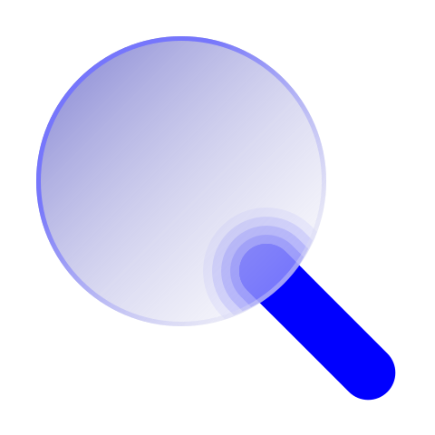
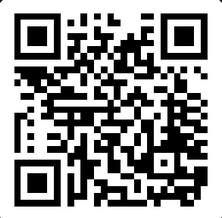
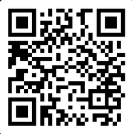
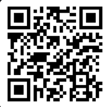

<div align="center">

&nbsp;&nbsp;

### Native SHA-256 file integrity verification for Windows, built in Rust.

<a href="https://github.com/rouhalamin/checksum/releases/tag/v1.1.0"></a>
<a href="https://github.com/rouhalamin/checksum/blob/main/LICENSE"></a>


<a href="https://github.com/rouhalamin/checksum/issues"></a>

<p></p>

**[Download for Windows](https://github.com/rouhalamin/checksum/releases/download/v1.1.0/CheckSum.exe)** &nbsp;·&nbsp;
[Release Notes](https://github.com/rouhalamin/checksum/releases/tag/v1.1.0) &nbsp;·&nbsp;
[Website](https://checksumapp.netlify.app/) &nbsp;·&nbsp;
[Report an Issue](https://github.com/rouhalamin/checksum/issues)

</div>

<br>

## Overview

**CheckSum** is a lightweight, native Windows utility that verifies whether a downloaded file matches a trusted cryptographic reference. It computes the file's SHA-256 hash locally and lets you compare it against the value published by the file's original source — no network calls, no telemetry, no third-party services involved.

> [!IMPORTANT]
> Matching SHA-256 digests proves that your file is byte-for-byte identical to the reference it was compared against. It does **not**, by itself, prove that the software is safe or free of malicious code — see [Security Considerations](#security-considerations) for the full distinction.

<br>

## Why It Matters

Files downloaded from a torrent, mirror, unofficial re-host, or file-sharing link aren't always identical to what the original publisher released — sometimes due to corruption in transit, sometimes due to tampering.

CheckSum gives you a simple, offline way to answer one specific question: **"Is the file I have identical to the file the trusted source published?"**

1. Open CheckSum.
2. Select the downloaded file.
3. Enter the trusted SHA-256 hash published by the original source.
4. Let CheckSum compute the file's digest.
5. Compare the result against the trusted reference.

If the hashes match, your file is identical to that reference. If they don't, it isn't — and shouldn't be treated as the authentic, verified file.

<br>

## Key Features

| | |
|---|---|
| 🦀 **Native & lightweight** | Written in Rust with a native Win32 GUI — no runtime, no bundled browser engine. |
| 🔒 **Fully offline** | Hashing happens entirely on your machine. Nothing is ever uploaded or transmitted. |
| ⚡ **Fast on large files** | Chunked 4 MiB reads on a background thread keep the UI responsive on multi-gigabyte files. |
| 🔓 **Open source** | GPL-3.0 licensed. The complete source is available for anyone to read, audit, or rebuild. |
| 🎯 **Single purpose** | Does one job — SHA-256 comparison — and does not attempt to be an antivirus or malware scanner. |

<br>

## Download

| | |
|---|---|
| **Latest version** | `v1.1.0` |
| **Executable** | `CheckSum.exe` |
| **Direct download** | **[CheckSum.exe (v1.1.0)](https://github.com/rouhalamin/checksum/releases/download/v1.1.0/CheckSum.exe)** |
| **All releases** | [github.com/rouhalamin/checksum/releases](https://github.com/rouhalamin/checksum/releases/tag/v1.1.0) |
| **Source code** | [github.com/rouhalamin/checksum](https://github.com/rouhalamin/checksum) |
| **Website** | [checksumapp.netlify.app](https://checksumapp.netlify.app/) |

<br>

## File Integrity Verification

Every release ships with a published SHA-256 reference hash. **This is a project-provided value, not an independently audited one** — you're encouraged to verify it yourself using tools you already trust.

**CheckSum.exe v1.1.0 — SHA-256:**

```
bb42d17310d5e1662b2235821a5f248a77c2bcc48566dbef441e8b5feb3d24bf
```

### Verifying on Windows

Windows includes a native command-line tool that can compute a file's SHA-256 hash without installing anything:

```powershell
certutil -hashfile CheckSum.exe SHA256
```

Compare the output line-by-line against the reference hash above.

- ✅ **Matches** — the file you downloaded is identical to the published release.
- ❌ **Does not match** — the file differs from the published release. Do not run it. Re-download from the [official release page](https://github.com/rouhalamin/checksum/releases/tag/v1.1.0) and verify again.

<br>

## Windows SmartScreen Guidance

CheckSum is developed and distributed independently and does not currently use a paid commercial code-signing certificate. As a result, **Windows SmartScreen may display a warning** when you run it — this is expected for unsigned, independently distributed executables, and is not by itself evidence that a file is unsafe.

**Verification-first workflow:**

1. Download `CheckSum.exe` only from the [official GitHub Release](https://github.com/rouhalamin/checksum/releases/download/v1.1.0/CheckSum.exe).
2. Compute its SHA-256 with `certutil` (see above).
3. Compare the result against the [published reference hash](#file-integrity-verification).
4. Only after independently confirming the file matches, if Windows still shows a warning, you may choose to continue via its **More info → Run anyway** path.

Step 4 is an optional continuation available *after* verification — never a substitute for it. Verification is the actual safety measure; SmartScreen is simply a prompt to perform it.

<br>

## How It Works

CheckSum reads the target file in 4 MiB chunks on a background thread, feeding each chunk into a SHA-256 hasher (via the [`sha2`](https://crates.io/crates/sha2) crate). Progress, elapsed time, and bytes processed are reported live to the UI thread. Once hashing completes, the computed digest is compared — case-insensitively — against the hash you provided.

No file contents, hashes, file paths, or metadata ever leave your machine. CheckSum makes no network requests.

<br>

## Supported Platforms & Technology

| | |
|---|---|
| **Operating systems** | Windows 10, Windows 11 |
| **Language** | Rust |
| **Cryptographic primitive** | SHA-256 |
| **Interface** | Native Win32 GUI |
| **License** | [GPL-3.0](./LICENSE) |

<br>

## Security Considerations

**What SHA-256 verification establishes**

A matching hash means the file you have is byte-for-byte identical to the file the hash was originally generated from. This confirms a download wasn't corrupted in transit or substituted with a different file.

**What it does not establish**

- It does not prove the original file is free of malicious code — it proves your copy matches a *reference*, not that the reference itself is benign.
- It does not verify the identity or trustworthiness of whoever published the reference hash.
- A matching hash is not a substitute for antivirus scanning, code review, or downloading from a source you already trust.

**Why the source of a hash matters**

Always obtain the reference hash from an authenticated, trusted channel — ideally the same official source you're downloading the file from — rather than an unrelated third party.

**A mismatched hash**

Should always be treated as a warning sign. It means the file in your possession is not identical to what the trusted source published — do not run it, and re-obtain the file from the original source.

<br>

## Responsible Disclosure

If you discover a security vulnerability in CheckSum, please report it privately rather than opening a public issue.

**Report security issues to:** [rouhalaminerfani@gmail.com](mailto:rouhalaminerfani@gmail.com)

Please avoid publicly disclosing an exploitable vulnerability before the maintainer has had a reasonable opportunity to investigate and address it.

When possible, please include:

- Affected version
- Description of the vulnerability
- Steps to reproduce
- Proof of concept, if applicable
- Potential security impact
- Suggested mitigation, if you have one

<br>

## Bug Reports

Non-security bugs and general issues can be reported on the [issue tracker](https://github.com/rouhalamin/checksum/issues).

When filing a report, it helps to include:

- CheckSum version
- Windows version
- Steps to reproduce the issue
- Expected vs. actual behavior
- Screenshots or error text, if relevant

<br>

## Contributing

Contributions of all sizes are welcome, including:

- Bug reports and reproductions
- Documentation improvements
- Security review and hardening suggestions
- Feature suggestions
- Testing on different Windows configurations
- Pull requests and code review

If you're planning a larger change, opening an issue first to discuss the approach is appreciated.

<br>

## Support the Project

Hi, I'm Rouhalamin.

I spent months building CheckSum from scratch in Rust, putting countless late nights into its performance, reliability, and security. In a space full of similar tools, my goal was to make something fast, focused, and trustworthy — and to keep it fully open source rather than gating it behind a paywall, because I believe useful security tools should be accessible to everyone.

As an independent developer without financial backing, keeping a security-focused open-source project alive is a real challenge. If CheckSum has helped you verify a download, protect your files, or save you time, your support goes directly toward future development, testing, infrastructure, documentation, and security improvements.

Thank you for supporting independent open-source development.

### Cryptocurrency Donations

> [!WARNING]
> Always double-check the **network** before sending funds. Ethereum and USDT/Tether use **different blockchains** — sending funds on the wrong network may result in permanent loss.

<table>
<tr>
<th align="center">Bitcoin (BTC)</th>
<th align="center">Ethereum (ETH)</th>
<th align="center">Tether (USDT)</th>
</tr>
<tr>
<td align="center"></td>
<td align="center"></td>
<td align="center"></td>
</tr>
<tr>
<td align="center">Network: <strong>Bitcoin</strong></td>
<td align="center">Networks: <strong>Base · Optimism · ERC-20</strong></td>
<td align="center">Network: <strong>TRC-20 (TRON)</strong></td>
</tr>
<tr>
<td align="center">

```
bc1qgsxsy5wp6twxhuxhvnujd8pza788ra5j4j67gu
```

</td>
<td align="center">

```
0x6E6764da4c477a08318224B992Bb54Cedd4197a0
```

</td>
<td align="center">

```
TDcg8aKadKRZx97Fw5p7BfCGXBBgWFy6Vh
```

</td>
</tr>
</table>

<br>

## License

CheckSum is released under the **[GNU General Public License v3.0](./LICENSE)**.

You are free to use, study, modify, and redistribute this software under the terms of the GPL-3.0, including creating and distributing your own forks. Any redistributed modified version must also remain licensed under GPL-3.0 and retain the corresponding copyright and license notices, as required by the license. See the [`LICENSE`](./LICENSE) file for the full legal text.

<br>

## Developer & Contact

<div align="center">

**Rohulamin Erfani**
*Independent developer*

<a href="https://wa.me/93702302034"></a>
<a href="https://t.me/rouhalamin_erfani"></a>
<a href="https://www.linkedin.com/in/rouhalamin/"></a>
<a href="https://github.com/rouhalamin"></a>
<a href="mailto:rouhalaminerfani@gmail.com"></a>
<a href="https://www.instagram.com/rouhalaminerfani/"></a>

<br><br>

<sub>CheckSum · Licensed under GPL-3.0 · Built with Rust</sub>

</div>
